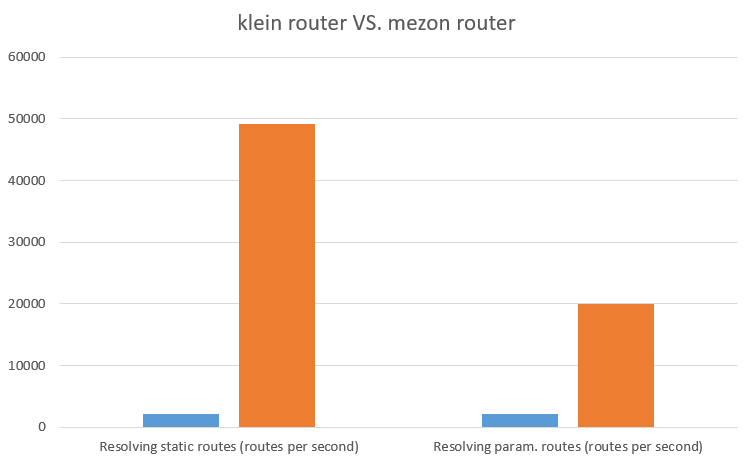

Recently I have decided to measure speed of my [router](https://github.com/alexdodonov/mezon-router)

And results were quite interesting.

I have measured the productivity in two tests:

1. Static routes without any regexp parsing or variables in URI

2. URI with variables

The first test for the Mezon/Router:

```php
// static routes

$routerTest1 = new \Mezon\Router\Router();

$routerTest1->addRoute('/static', function () {
  return 'static';
}, 'GET');

$iterationCount1 = 100000;

$startTime1 = microtime(true);

for ($i = 0; $i < $iterationCount1; $i ++) {
  $routerTest1->callRoute('/static');
}

$endTime1 = microtime(true);
```

And the second test:

```php
// parametrized routes

$routerTest2 = new \Mezon\Router\Router();

$routerTest2->addRoute('/[i:id]', function () {
  return 'param';
}, 'GET');

$iterationCount2 = 100000;

$startTime2 = microtime(true);

for ($i = 0; $i < $iterationCount2; $i ++) {
  $routerTest2->callRoute('/1');
}

$endTime2 = microtime(true);
```

For the klein/klein router it is almost the same:

```php
// static routes

$_SERVER['REQUEST_URI'] = '/static';

$routerTest1 = new \Klein\Klein();

$routerTest1->respond('GET', '/static', **function** () {
  return 'static';
});

$iterationCount1 = 10000;

$startTime1 = microtime(true);

for ($i = 0; $i < $iterationCount1; $i ++) {
  $routerTest1->dispatch(null,null,true,\Klein\Klein::DISPATCH_CAPTURE_AND_RETURN);
}

$endTime1 = microtime(true);
```

And the second one:

```php
// parametrized routes

$_SERVER['REQUEST_URI'] = '/1';

$routerTest2 = new \Klein\Klein();

$routerTest2->respond('GET', '/[i:id]', function () {
  return 'static';
});

$iterationCount2 = 10000;

$startTime2 = microtime(true);

for ($i = 0; $i < $iterationCount2; $i ++) {
  $routerTest2->dispatch(null,null,true,\Klein\Klein::*DISPATCH_CAPTURE_AND_RETURN*);
}

$endTime2 = microtime(true);
```

I have got the following results:




As you can see - Mezon router is up to 25 times faster than Klein router.

# I'll be very glad if you'll press "STAR" button )